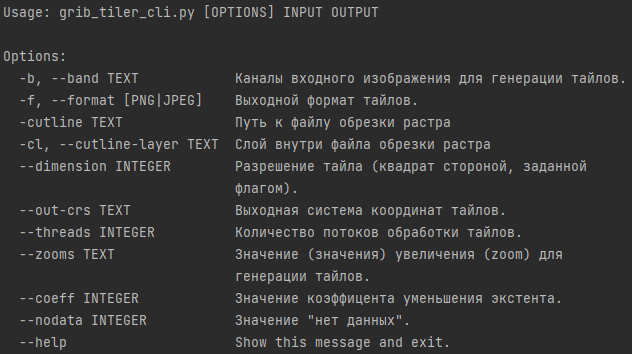

# GRIB tiler


## Установка

_Требуется установленный GDAL 3.4+ и Python 3.7+_

Необходимо выполнить следующую команду:

```pip install -r requirements.txt```

## Использование

Всю необходимую информацию по использованию утилиты можно получить при помощи команды --help:
```python grib_tiler_cli.py --help```


